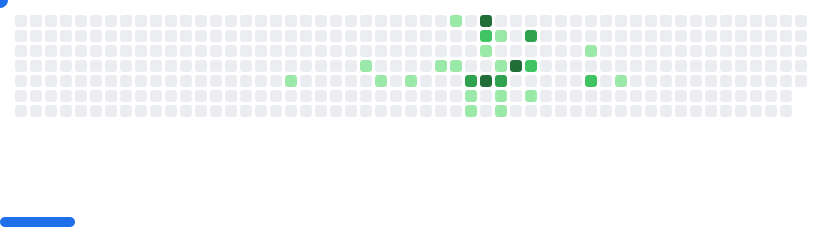

<picture>
  <source
    media="(prefers-color-scheme: dark)"
    srcset="images/breakout-dark.svg"
  />
  <source
    media="(prefers-color-scheme: light)"
    srcset="images/breakout-light.svg"
  />
  
</picture>

#  Hi, I'm Thangamanikandan

 Python Full Stack Developer (Fresher)  
 Django | React | DRF | MySQL  
 Passionate about building real-world web applications

##  About Me
-  B.Tech IT (2025 Graduate)
-  Currently building real-world full-stack projects
-  Strong in Backend (Django REST Framework)
-  Looking for Full Stack Developer roles

##  Tech Stack
- Frontend: HTML, CSS, JavaScript, React, Tailwind
- Backend: Python, Django, DRF
- Database: MySQL
- Tools: Git, GitHub, Postman, VS Code

##  Projects

###  Clinic Management System
- Role-based system (Admin, Lab, Doctor)
- Lab reports & billing automation
- Django + React + MySQL

 Live: https://cmsadminlab.vercel.app/  
 Code: https://github.com/manikandan-mk007/CMS_Admin_Lab  

###  Resume Matcher
- AI-based resume matching system
- NLP similarity scoring

 Code: https://github.com/manikandan-mk007/Resume_Matcher_Pro  

###  Expense Tracker
- Track expenses with clean UI

 Code: https://github.com/manikandan-mk007/Expense-Tracker-React  

###  Portfolio
 Live: https://portfolio-05cw.onrender.com/  
 Code: https://github.com/manikandan-mk007/portfolio  

##  Contact
- LinkedIn: https://www.linkedin.com/in/thangamanikandan-i-560b20396/
- Portfolio: https://portfolio-05cw.onrender.com/

 Thanks for visiting my profile!
