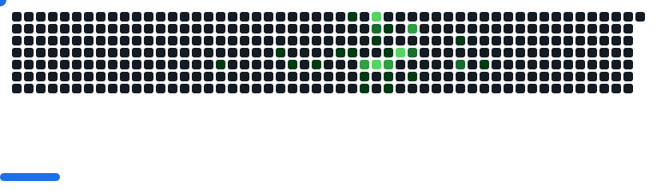

  

<h1 align="center">Hi, I'm Thangamanikandan</h1>
<h3 align="center">Python Full Stack Developer | Django | React | DRF | MySQL</h3>

  
  
  

##  About Me

* 🎓 B.Tech Information Technology (2025)
* 💻 Python Full Stack Developer (Fresher)
* 🤖 Passionate about AI-powered applications & real-world systems
* 🧠 Skilled in building scalable backend APIs & modern frontend UIs
* 🎯 Actively seeking **Full Stack / AI Developer roles**

##  What I Do

* Build **real-world SaaS applications**
* Develop **AI/NLP-powered systems**
* Create **browser extensions with backend integration**
* Design **clean, modern UI dashboards**

##  Tech Stack

###  Languages

###  Frameworks & Libraries

###  Authentication & Backend

###  AI / Data Science

###  Data Visualization & BI

###  Database

###  Tools & IDEs

###  Deployment & DevOps

##  Connect With Me
- LinkedIn: https://www.linkedin.com/in/thangamanikandan-i-560b20396/
- Portfolio: https://portfolio-o5cw.onrender.com/
- Email: thangamanikandan.it@gmail.com

